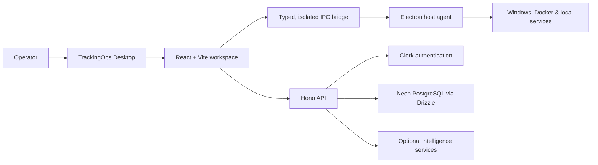

# TrackingOps

  <strong>Operational clarity for the systems that matter.</strong> 
  A desktop command center for observing, securing, and acting on Windows infrastructure.

  
  
  

> **A private-source product showcase.** This repository intentionally contains no application source code, credentials, customer data, or internal infrastructure configuration.

---

## The operating picture, not another dashboard

Modern operations teams rarely lack signals; they lack a trustworthy way to connect them. **TrackingOps** brings the health, security posture, and operating context of a Windows host into one focused desktop workspace.

It is built for the moments where context matters most: a disk approaching capacity, a container that has stopped responding, a suspicious persistence mechanism, or an incident that needs an immediate, evidence-based action.

| Observe | Investigate | Act |
| :--- | :--- | :--- |
| Live CPU, memory, disk, GPU, process and network telemetry | Security events, software inventory, SSL posture and threat scans | Guarded Docker operations, runbooks, alert acknowledgement and remediation workflows |

## What TrackingOps does

### Live infrastructure intelligence

- Continuous host telemetry for compute, memory, disks, network interfaces, processes, GPU and power context.
- Docker visibility covering containers, images, networks, volumes, logs and lifecycle status.
- Wi-Fi, LAN/WAN, listening-port and protocol-level network views.
- Host registration and compact metric history for fleet-level context.

### Security operations built into the workflow

- On-demand threat scanning across processes, network activity, persistence mechanisms and user-selected folders.
- Windows Security event-log visibility, security baseline checks, backup status, installed-software inventory and certificate checks.
- Human-confirmed remediation for sensitive actions; no destructive response runs silently in the background.
- Organization-scoped API access and audit-ready activity records.

### Operations that close the loop

- Alert rules, severity-aware alert handling and incident context.
- Runbooks with a deliberately constrained first automation action: restarting a named Docker container on the enrolled host.
- Synthetic HTTP, TCP and DNS checks from the local machine.
- Update awareness, package-update checks and a built-in application update workflow with SHA-256 verification.

### AI where it is useful

- An operational copilot for contextual questions over recorded telemetry.
- Threat-triage and power-calibration workflows designed to support an operator, not replace one.
- Configurable AI provider settings at the platform-administration layer.

## Architecture at a glance

| Layer | Responsibility |
| --- | --- |
| **Desktop experience** | React interface designed around operational workflows rather than raw charts. |
| **Local host agent** | Electron main process gathers host state and performs explicitly requested local actions. |
| **Secure bridge** | A narrow, typed preload API separates the renderer from native capabilities. |
| **Control plane** | Hono API persists organization-scoped data, alerts, audit events, rules and runbook executions. |
| **Identity & data** | Clerk provides authentication and organization context; Neon + Drizzle provide the application data layer. |

## Designed with operational safeguards

TrackingOps treats local control as a privilege, not a convenience.

- Renderer access to native features is exposed through a restricted IPC surface.
- The desktop window uses context isolation and disables Node integration in the UI.
- Actions such as process termination, persistence remediation and file deletion require an explicit operator confirmation in the product flow.
- API routes derive tenant scope from the authenticated organization rather than trusting a client-supplied organization identifier.
- Downloaded desktop updates are checked against their expected SHA-256 value before installation.

Security is an ongoing practice. If you believe you have found a vulnerability, please do **not** open a public issue; use the contact channel below.

## Availability

TrackingOps is proprietary software and is currently distributed through controlled channels.

| Item | Availability |
| --- | --- |
| Windows desktop application | Private preview / controlled distribution |
| Source code | Not publicly available |
| Evaluations & product discussions | Available on request |
| Security reports | Private disclosure only |

## Technology foundation

`Electron` · `React` · `TypeScript` · `Vite` · `Hono` · `Clerk` · `Neon PostgreSQL` · `Drizzle ORM` · `Docker Engine API`

## Frequently asked questions

<strong>Why is the source code not in this repository?</strong>

TrackingOps includes proprietary desktop, operational and security workflows. This repository exists to provide a transparent product overview while keeping source code, secrets, deployment configuration and customer-facing operational details private.

<strong>Does TrackingOps replace an observability platform?</strong>

No. It is a focused desktop operations layer: it combines immediate local visibility, guided investigation and controlled actions on the operator's machine. It can complement broader observability and incident-management systems.

<strong>Which operating systems are supported?</strong>

The current desktop experience is designed for Windows 10 and Windows 11. The product uses native Windows telemetry and security integrations.

## Contact

For evaluation requests, partnership conversations or responsible security disclosure, contact the TrackingOps team through the organisation that shared this repository with you.

---

  <strong>TrackingOps</strong> 
  Observe clearly. Respond deliberately.

