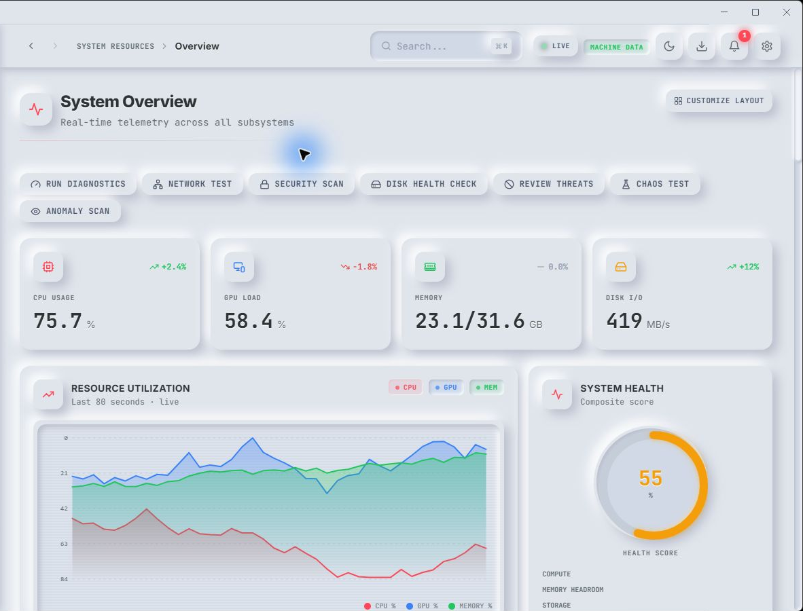
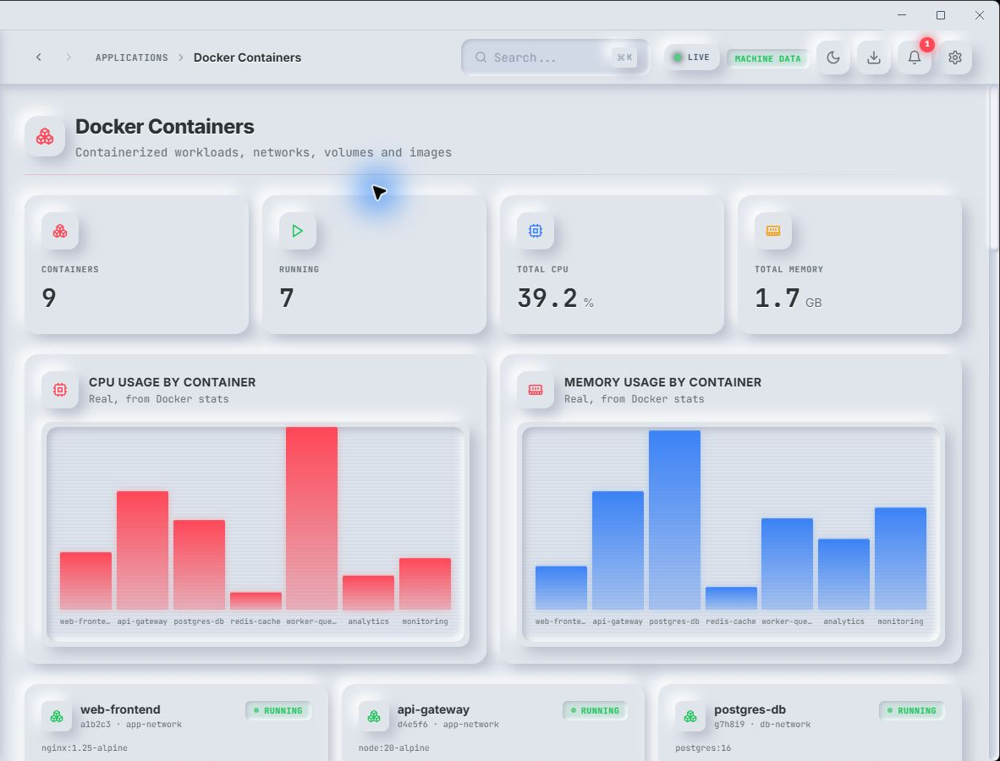
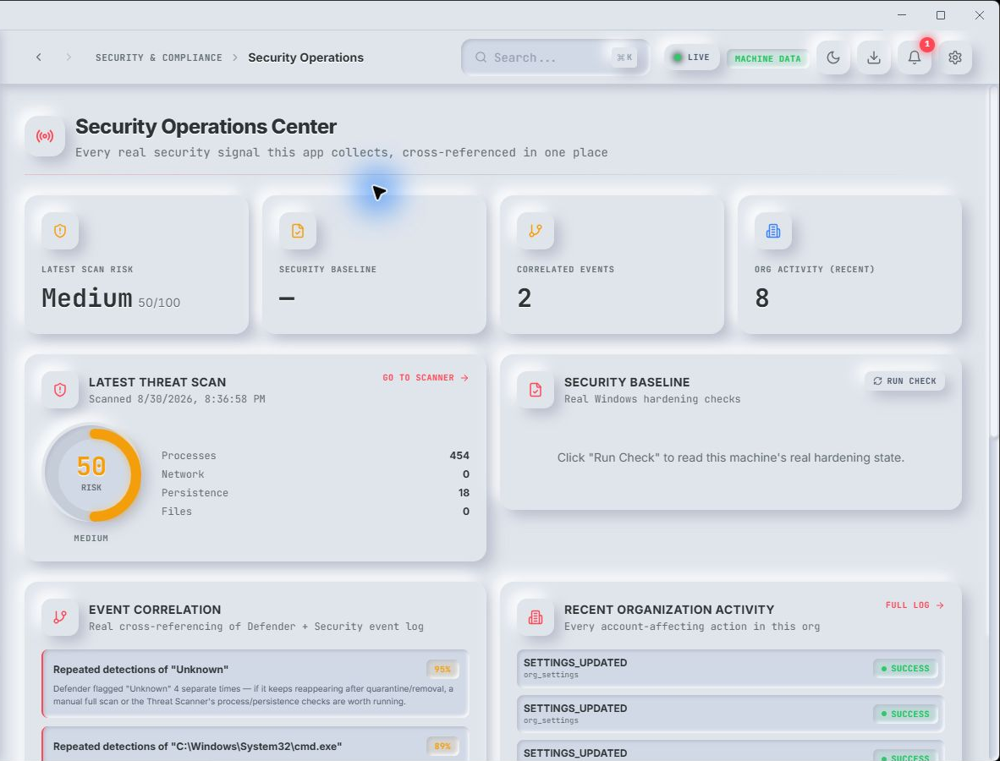
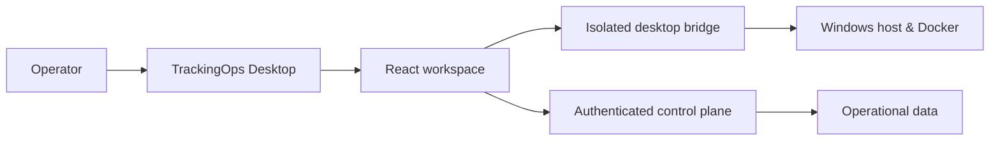

  

  
  
  

<h1 align="center">TrackingOps</h1>

  <strong>See the system. Understand the signal. Act with intent.</strong> 
  A focused Windows command center for local infrastructure, containers, and security operations.

  <a href="#the-product">Explore the product</a> ·
  <a href="#a-single-workspace-for-operations">See the workspaces</a> ·
  <a href="#ai-that-stays-grounded-in-the-operation">Explore AI</a> ·
  <a href="https://trackingops.vercel.app">Install TrackingOps</a>

> [!IMPORTANT]
> **This is the public product showcase for a private-source application.** No production source code, credentials, deployment configuration, customer data, or private infrastructure details are included here.

---

## The product

Operations teams do not need more disconnected charts. They need a coherent picture of what is happening, why it matters, and which action is appropriate next.

**TrackingOps** unifies local system telemetry, Docker workloads, operational checks, and security context in a purpose-built desktop experience. It is designed to keep high-value information close to the operator—without turning every screen into a wall of data.

| Observe | Understand | Respond |
| :-- | :-- | :-- |
| Surface CPU, memory, GPU, storage, network and process context in real time. | Bring operational and security signals into the same decision surface. | Use deliberate, operator-controlled workflows for the next step. |

### System intelligence at a glance

The Overview is the starting point: a live operational readout of the Windows host, from resource pressure to overall system condition. It is designed for fast orientation before a deeper investigation.

  

## A single workspace for operations

### Containers, in context

The Docker workspace brings containers, resource use, networking, volumes and images together. Operators can move from a workload’s current state to its operational context without hopping between tools.

  

| What the workspace brings together | Why it matters |
| --- | --- |
| Container state and resource trends | Identify pressure and unhealthy workloads quickly. |
| Images, networks and volumes | Understand the moving parts behind a deployment. |
| Logs and lifecycle controls | Investigate and act from the same operating surface. |

### Security that belongs in the operational flow

Security signals are most useful when they arrive with context. The Security Operations Center organizes posture checks, event activity, scan results and hardening signals in one place, so an operator can assess priority before taking action.

  

| Security workspace | Designed to support |
| --- | --- |
| Baseline and posture checks | A clearer view of host hardening and configuration drift. |
| Security events and activity | Faster investigation with operational context alongside the signal. |
| Guided scan and response flows | Intentional, human-reviewed action—not silent destructive automation. |

## Signal integrity

Trust comes from being clear about the source of each signal.

- **Live local telemetry** covers system resources and the local machine context exposed by the desktop application.
- **Operational workspaces** organize infrastructure and security workflows around the systems the operator manages.
- **Demo or illustrative insight panels** are explicitly identified inside the product when a view is meant to demonstrate a workflow rather than report a live production event.

The screenshots above are authentic views of the application. They have been cropped to remove local user and device-identifying information.

## AI that stays grounded in the operation

TrackingOps includes **AI KILLING**, an operational copilot designed to help an operator reason over the context they choose to provide—not a generic chatbot detached from the system.

It can work from collected metric history, recent alerts and explicit on-demand investigation context to help answer operational questions such as *“What changed?”*, *“Which process is contributing to the pressure?”*, or *“What should I verify next?”*.

| AI KILLING capabilities | How it is used |
| --- | --- |
| Contextual operational chat | Ask questions about an enrolled host’s collected metrics and recent alerts. |
| Conversation history | Keep an investigation thread, return to it later, and export the discussion when needed. |
| On-demand investigation tools | Bring fresh diagnostic or security context into a conversation only when the operator requests it. |
| Mention-based context | Select the relevant operational surface instead of expecting the assistant to guess the scope. |
| Configurable AI control plane | Configure the model, temperature and system guidance at the administration layer. |

The product deliberately distinguishes AI-backed analysis from illustrative dashboard content. Where a screen is a demo, the UI says so. Where the copilot makes a claim about host activity, it is designed to ground that answer in the collected context supplied to it.

## More than monitoring

TrackingOps is built as an operator’s workspace, not merely a visual dashboard.

| Domain | Included operational surfaces |
| --- | --- |
| **Host & performance** | CPU, GPU, memory, storage, power, process and local history views. |
| **Network** | Protocol visibility, WAN/LAN context, Wi-Fi stations and connection-oriented investigation. |
| **Applications & data** | Web and local applications, APIs, databases and Docker workloads. |
| **Observability** | Incident management, distributed tracing, synthetic monitoring, capacity and forecasting views. |
| **Security & compliance** | Security operations, threats, audit/compliance and guided scanning workflows. |
| **Automation** | Alerting, runbooks, deliberate response flows and activity context. |

## Built for deliberate control

TrackingOps is designed around a simple principle: privileged local actions deserve a visible, intentional operator decision.

| Capability | Operator experience |
| --- | --- |
| Host diagnostics | Inspect resources, processes, disks, network context and system health from a unified desktop view. |
| Docker operations | Review workloads and use lifecycle controls only when the operator chooses to act. |
| Security workflows | Review checks and scan context before moving into sensitive remediation paths. |
| Operational history | Keep relevant activity close to the investigation rather than scattered across disconnected tools. |

## Product foundation

The private product is built with a modern desktop and web stack, including **Electron**, **React**, **TypeScript**, **Vite**, **Hono**, **Clerk**, **Neon PostgreSQL**, **Drizzle ORM**, and Docker integrations.

## Availability

TrackingOps is proprietary software, shared through controlled channels.

  <a href="https://trackingops.vercel.app"><strong>Install or discover TrackingOps →</strong></a>

| Item | Availability |
| --- | --- |
| Windows desktop application | Private preview / controlled distribution |
| Public repository | Product presentation and release context only |
| Application source code | Not publicly available |
| Evaluations and product discussions | Contact the repository owner |
| Security reports | Please use a private channel; do not open a public issue with sensitive details |

## FAQ

<strong>Why is the source code not included?</strong>

TrackingOps contains proprietary desktop, infrastructure and security workflows. This repository is intentionally limited to the public product story and visual product documentation.

<strong>Does TrackingOps replace an observability platform?</strong>

No. It is a focused operator experience for the local Windows environment and its managed workflows. It can complement broader observability, security and incident-management systems.

<strong>Which operating systems are supported?</strong>

The current desktop product is designed for Windows 10 and Windows 11.

---

  <strong>TrackingOps</strong> 
  A clearer way to operate.

