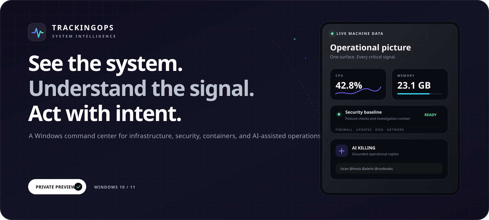
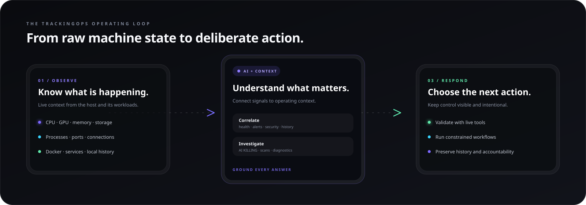
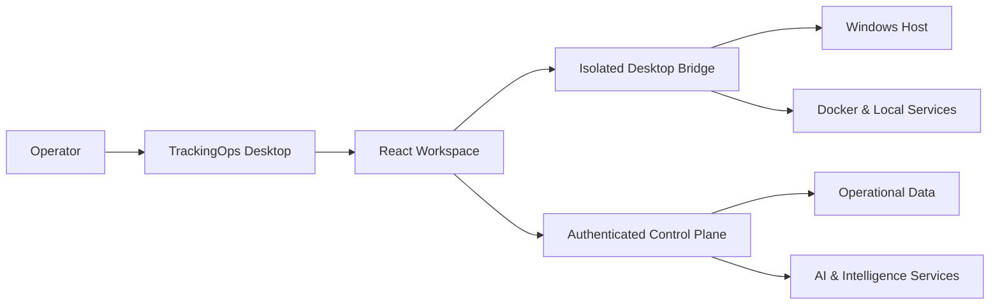

  

  
  
  

  <strong>The desktop operations cockpit for Windows.</strong> 
  Live machine telemetry, container operations, security workflows, observability, and a grounded AI copilot—inside one deliberate operating surface.

  <a href="https://trackingops.vercel.app"><strong>Download</strong></a> ·
  <a href="#-the-operating-loop">Operating loop</a> ·
  <a href="#-product-tour">Product tour</a> ·
  <a href="#-ai-killing--operational-intelligence">AI KILLING</a> ·
  <a href="#-capability-map">Capabilities</a> ·
  <a href="#-architecture--trust">Architecture</a> ·
  <a href="./SUPPORT.md">Support</a>

> [!IMPORTANT]
> This repository is the public product presentation for **TrackingOps**, a private-source application. It intentionally contains no production source code, credentials, customer data, or internal deployment configuration.

---

## One machine. Every signal. One decision surface.

Infrastructure tools are excellent at producing information. The harder problem is turning that information into a decision while the situation is still unfolding.

TrackingOps connects the local Windows host, Docker workloads, network activity, security posture, operational history, and AI-assisted investigation in a single desktop environment. It is designed to reduce context switching and keep the operator in control from first signal to next action.

| **OBSERVE** | **UNDERSTAND** | **RESPOND** |
| :--- | :--- | :--- |
| Read live CPU, GPU, memory, storage, processes and network state. | Correlate system health, alerts, security posture and operational history. | Move into guided checks, runbooks and explicit operator-controlled actions. |

  7 operational domains &nbsp;·&nbsp; 20+ focused workspaces &nbsp;·&nbsp; 14 live AI investigation tools &nbsp;·&nbsp; 1 desktop control plane

---

## ✦ The operating loop

TrackingOps is organized around the way operational decisions actually happen: first establish reality, then build context, then choose a controlled response.

  

This loop is repeated across the product. A CPU spike can lead into process inspection. An exposed service can lead into port and connection context. A security finding can be handed to AI KILLING together with a fresh scan—without hiding the source of the evidence.

---

## ✦ Product tour

### The operating picture

The System Overview is built for orientation at a glance. Live resource signals, health context, diagnostics and deeper investigation paths begin from the same screen.

  

**Live machine context**

- CPU and GPU utilization, memory pressure and disk activity.
- Processes, physical disks, network connections and local history.
- System health cues with direct paths into diagnostics and investigation.
- Explicit labels distinguish real machine telemetry from illustrative product demonstrations.

### Containers without the context switch

The Docker workspace brings workload state and resource context together so an operator can move from “something changed” to “which container is responsible?” without leaving the product.

  

| Workload visibility | Operational context | Deliberate control |
| --- | --- | --- |
| Container state, images and resource usage | Networks, volumes, logs and supporting components | Lifecycle actions remain visible and operator initiated |

### Security inside the operational flow

Security is presented as operating context—not as a detached report. TrackingOps brings posture checks, event activity, scanning and hardening signals close to the machine state that gives them meaning.

  

**Investigate from one workspace**

- Threat scanning across processes, network activity, persistence mechanisms and selected files.
- Security baseline checks for firewall, antivirus, updates and BitLocker-related posture.
- Installed-software vulnerability matching against CVE data.
- Security events, audit context, backups, certificate checks and remediation paths.

---

## ✦ AI KILLING — operational intelligence

**AI KILLING** is the embedded operations copilot for TrackingOps. It is designed to reason over the context the operator selects: collected metric history, recent alerts, fleet context, scan results and fresh tool output.

It is not presented as an all-knowing chatbot. The interface makes the source of context visible and lets the operator decide when a live investigation tool should run.

### Ask with context

Use natural-language questions to explore what changed, which process contributed to pressure, what an alert means, or what should be verified next. Conversation threads preserve the investigation and can be exported as Markdown.

### Pull in the right surface

Mention-driven context lets the operator attach relevant hosts, scans, power profiles, runbooks or audit activity to the conversation instead of asking the model to guess the scope.

### Run live tools on demand

| Security | System | Network | Infrastructure |
| --- | --- | --- | --- |
| `/scan` threat scan | `/processes` top activity | `/ports` listening services | `/docker` workload state |
| `/vulns` CVE matching | `/disks` SMART health | `/connections` live states | `/backups` job status |
| `/baseline` hardening checks | `/gpu` utilization and thermals | `/dns` resolver latency | `/updates` package posture |
|  |  | `/wifi` nearby networks · `/arp` local devices |  |

Fresh tool results are handed back to the copilot as grounding for the answer that follows. Desktop-only tools remain explicitly identified.

### Keep the intelligence controllable

- Organization-scoped conversation history.
- Configurable model, temperature and system guidance.
- Visible model/sample metadata and confidence cues.
- Stop, regenerate, copy, pin, search and export controls.
- A separate automation surface for trigger-to-action workflows.

---

## ✦ Capability map

### System resources

`Overview` · `Compute / CPU / GPU` · `Memory & Disk` · `Power & Energy` · `Processes & Infrastructure` · `Local History`

Understand current machine state, inspect resource pressure and retain enough local history to investigate change over time.

### Network intelligence

`Network & Protocols` · `WAN / LAN` · `Wi-Fi Stations`

Inspect traffic, listening ports, connection states, adapters, DNS behavior and visible devices around the host.

### Applications and workloads

`Web & Local Apps` · `API & Databases` · `Docker Containers`

Bring service availability, application context, database visibility and container operations into the same workspace as machine telemetry.

### AI and automation

`AI KILLING` · `Alerting & Runbooks`

Investigate with grounded operational context, define alerting behavior and hand deliberate work to constrained automation flows.

### Observability

`Incident Manager` · `Distributed Tracing` · `Synthetic Monitoring` · `Capacity & Forecasting`

Move from an individual signal to incident context, request-path visibility, proactive checks and longer-term resource trends.

### Security and compliance

`Security Operations` · `Security & Threats` · `Audit & Compliance`

Connect host security posture, live checks, investigation output and audit-relevant activity without separating security from operations.

### System administration

`System Config`

Keep product, host and platform configuration accessible through a dedicated administrative surface.

---

## ✦ Built for the people carrying the pager

### System and infrastructure engineers

Get from resource pressure to the process, disk, connection or workload behind it while keeping the current host context visible.

### Security operators

Bring host posture, active connections, persistence checks, installed-software vulnerabilities and event context into the same investigation surface.

### Platform and DevOps teams

Connect Docker state, service checks, incidents, tracing, forecasts, alerts and runbooks without turning the desktop into another disconnected dashboard wall.

### Technical leaders

Use a consistent operational model across system health, risk, incidents and response—while maintaining clear boundaries between live evidence and illustrative product views.

---

## ✦ Moments where TrackingOps earns its place

| Situation | TrackingOps path | Operational outcome |
| --- | --- | --- |
| **The machine suddenly feels slow** | Overview → Compute → Processes → AI KILLING | Identify pressure, inspect contributors and preserve the investigation context. |
| **A container stops behaving normally** | Docker → logs/resources → connections → runbook | Move from workload state to supporting evidence and a deliberate lifecycle action. |
| **A listening port is unexpected** | Network & Protocols → process ownership → `/ports` or `/connections` | Verify the owning process and surrounding network activity before responding. |
| **A host may be exposed** | Security Operations → baseline → `/vulns` → `/scan` | Combine posture, software exposure and fresh host findings in one investigation. |
| **Capacity risk is emerging** | Local History → Capacity & Forecasting → alerts | Translate a trend into an earlier operational decision. |
| **A handoff needs evidence** | Incident context → AI thread → Markdown export | Keep the reasoning, evidence and next checks together for the next operator. |

---

## ✦ Why desktop-first

Some of the most valuable operational signals live closest to the machine: active processes, ports, local adapters, installed software, security state, disks and Docker. A desktop control plane can gather that context directly while still connecting it to authenticated organization-level history and workflows.

TrackingOps uses that position to combine three qualities that are often separated:

1. **Immediate local truth** — see the host from the host.
2. **Persistent operational context** — retain metrics, alerts, conversations and activity beyond the current moment.
3. **Explicit local control** — keep sensitive actions visible and intentional.

---

## ✦ Designed around operator intent

TrackingOps treats local control as a privilege. Sensitive flows are designed to keep the operator aware of what is about to happen and why.

| Principle | Product behavior |
| --- | --- |
| **Context before action** | Diagnostics, history and related signals remain close to action controls. |
| **Human-reviewed response** | Sensitive remediation paths require an explicit operator decision. |
| **Honest signal labeling** | Live data, configured integrations and illustrative demo panels are differentiated in the UI. |
| **Constrained automation** | Runbooks expose deliberate trigger-to-action workflows rather than invisible autonomous control. |
| **Organization boundaries** | Authenticated control-plane data is scoped to the active organization. |

---

## ✦ Architecture & trust

| Layer | Role |
| --- | --- |
| **Desktop experience** | A React and TypeScript workspace organized around operational decisions. |
| **Local host agent** | Electron-based access to Windows telemetry and explicitly requested native actions. |
| **Desktop bridge** | A typed, isolated interface between the visual workspace and native capabilities. |
| **Control plane** | Hono APIs for hosts, metrics, alerts, runbooks, incidents, audit activity and AI conversations. |
| **Identity and data** | Clerk authentication with Neon PostgreSQL and Drizzle ORM for organization-scoped product data. |

**Technology foundation**

`Electron` · `React` · `TypeScript` · `Vite` · `Hono` · `Clerk` · `Neon PostgreSQL` · `Drizzle ORM` · `Docker Engine API`

---

## ✦ Signal integrity

Trust begins with knowing where a number came from.

- **Live local telemetry** reflects system resources and context available from the running desktop application.
- **Connected operational data** is shown when the required host, API or platform integration is available.
- **Illustrative product content** is labeled as demo data inside the interface.
- **AI answers** are designed to use collected samples, selected context and the output of operator-requested tools.

The screenshots in this repository are authentic TrackingOps product views. They have been cropped to remove local profile and device-identifying information.

---

## ✦ Get TrackingOps

  

  <a href="https://trackingops.vercel.app"><strong>Open the official TrackingOps download experience →</strong></a>

| Product item | Availability |
| --- | --- |
| Windows desktop application | Private preview / controlled distribution |
| Official product experience | [trackingops.vercel.app](https://trackingops.vercel.app) |
| Public repository | Product presentation and release context only |
| Application source code | Proprietary and not publicly distributed |
| Product support | See [SUPPORT.md](./SUPPORT.md) |
| Security reports | Follow [SECURITY.md](./SECURITY.md) and use a private channel |

---

## FAQ

<strong>Why is the source code not included?</strong>

TrackingOps contains proprietary desktop, infrastructure, security and AI-assisted workflows. This repository exists to present the product publicly without distributing production source code or internal configuration.

<strong>Does TrackingOps replace an observability or security platform?</strong>

No. TrackingOps is a focused desktop operations layer for the Windows environment and its connected workflows. It can complement broader observability, security and incident-management platforms.

<strong>Does every panel display live production data?</strong>

No. Core local telemetry and supported desktop checks use real machine context. Product demonstrations that are not connected to a live backend are explicitly marked as demo or illustrative content in the interface.

<strong>Which systems are supported?</strong>

The current desktop product is designed for Windows 10 and Windows 11. Some functions require the desktop application or an available local integration such as Docker.

---

  

  Private-source product showcase · © 2026 TrackingOps

  <a href="https://trackingops.vercel.app">Product</a> ·
  <a href="./SUPPORT.md">Support</a> ·
  <a href="./SECURITY.md">Security</a> ·
  <a href="./LICENSE">License</a>

